# 🤖 CrewAI Agent Workflows: Sequential vs. Hierarchical

A tutorial and "lab" project demonstrating how to build **AI Teams** (not just chatbots) using the **CrewAI** framework and **Google Gemini**.

> **Core Concept:** "Don't ask one smart AI to do everything. Ask a team of specialized AI Agents to work together."

---

## 🧐 What is CrewAI?

Most LLM applications are simple chatbots (Input $\rightarrow$ Output). **CrewAI** is a framework for orchestrating **Role-Playing Agents** that collaborate to solve complex tasks.

### **The 4 Building Blocks**
1.  **Agents ("The Who"):** Specialized workers with roles, goals, and backstories (e.g., "Senior Researcher").
2.  **Tasks ("The What"):** Specific assignments with clear deliverables (e.g., "Find 3 facts about Onam").
3.  **Process ("The Workflow"):** How the team collaborates (Sequential vs. Hierarchical).
4.  **Tools ("The How"):** Capabilities given to agents (e.g., Search, Calculator).

---

## 🏗️ Scenarios Implemented

This notebook implements three distinct patterns of multi-agent collaboration:

### **Scenario 1: The Sequential Crew (Relay Race)**
* **Workflow:** Agent A finishes $\rightarrow$ Passes work to Agent B $\rightarrow$ Done.
* **Use Case:** Simple pipelines (e.g., Research a topic, then write a post about it).
* **Code:** `Process.sequential`

### **Scenario 2: The Hierarchical Crew (Boss Mode)**
* **Workflow:** A **Manager AI** (Supervisor) plans the work, delegates tasks to specialized workers (LinkedIn Writer vs. Twitter Writer), and reviews the output.
* **Use Case:** Complex projects where the order of tasks might change dynamically.
* **Code:** `Process.hierarchical` (requires `manager_llm`)

### **Scenario 3: Dynamic Templates (Reusability)**
* **Workflow:** A flexible Agent setup that changes personality based on input variables.
* **Use Case:** Writing content for different platforms (Twitter, LinkedIn, Blog) without rewriting code.
* **Code:** `inputs={'social_platform': 'Twitter'}`

---
## 🏗️ Architecture & Scenarios

Here is a visual representation of the three workflows implemented in this project:

```mermaid
graph TD
    %% Styling
    classDef agent fill:#e1f5fe,stroke:#01579b,stroke-width:2px;
    classDef manager fill:#fff9c4,stroke:#fbc02d,stroke-width:2px;
    classDef input fill:#e0f2f1,stroke:#00695c,stroke-width:1px,stroke-dasharray: 5 5;
    
    %% --- SCENARIO 1: SEQUENTIAL ---
    subgraph "Scenario 1: Sequential (Relay Race)"
        Step1((Start)) --> Res1[🕵️ Cultural Researcher]
        Res1 -->|Passes Facts| Writer1[✍️ Social Media Writer]
        Writer1 --> End1((📢 Final Post))
    end
    
    %% --- SCENARIO 2: HIERARCHICAL ---
    subgraph "Scenario 2: Hierarchical (Boss Mode)"
        Step2((Start)) --> Boss{🤖 Manager LLM}
        
        Boss --"1. Delegate Research"--> Res2[🕵️ Researcher]
        Res2 --"Return Data"--> Boss
        
        Boss --"2. Assign LinkedIn"--> Link[💼 LinkedIn Specialist]
        Boss --"3. Assign Twitter"--> Twit[🐦 Twitter Specialist]
        
        Link --> Boss
        Twit --> Boss
        
        Boss --> End2((📢 Final Output))
    end
    
    %% --- SCENARIO 3: DYNAMIC ---
    subgraph "Scenario 3: Dynamic (Reusable)"
        Input[/"Input: {social_platform}"/] --> Agent3[✨ Flexible Agent]
        Agent3 -->|Adapts Persona| Output((🎯 Targeted Post))
    end

    %% Apply Styles
    class Res1,Writer1,Res2,Link,Twit,Agent3 agent;
    class Boss manager;
    class Input input;
```


---
## 🛠️ Installation & Usage

### 1. Clone the Repo
```bash
git clone [https://github.com/ergaikwadketan/CrewAI-Team-Orchestration.git](https://github.com/ergaikwadketan/CrewAI-Team-Orchestration.git)
cd CrewAI-Team-Orchestration
```

### 2. **Install Dependencies**
```bash

pip install -r requirements.txt
```

### 3. **Configure API Keys**
Open CrewAI_Workflow_Patterns.ipynb and replace the placeholder with your Google Gemini API Key:
```Python

os.environ["GOOGLE_API_KEY"] = "YOUR_KEY_HERE"
```
### 4. **Run the Scenarios**
Execute the cells in order to see the difference between a self-managed team (Sequential) and a manager-led team (Hierarchical).

---

### 📊 Example Output (Hierarchical)
```Plaintext

🏁 Kicking off Hierarchical Crew...
[Manager]: I need a report on Diwali. Researcher, get on it.
[Researcher]: Found 3 facts about Diwali...
[Manager]: Good. LinkedIn Writer, draft a post. Twitter Writer, make a tweet.
[LinkedIn Writer]: Here is the professional article...
[Twitter Writer]: ✨ Happy Diwali! 🪔 #FestivalOfLights
```
---
### Created By Ketan Dilip Gaikwad
